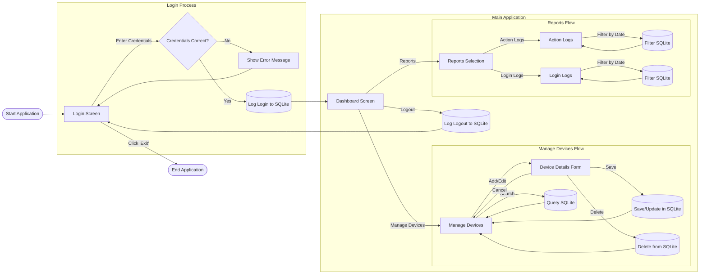

# 🖥️ CLIMS — Computer Laboratory Inventory Management System

**Project Instructions for GitHub Copilot**

---

## 1. 📘 Project Overview

We are developing **CLIMS**, a desktop-based **Computer Laboratory Inventory Management System** for **STI College Caloocan**.

**Tech Stack:**

- **Language:** Java (JDK 17 or higher)
- **UI Library:** Java Swing
- **Database:** SQLite (local file-based)
- **Purpose:** Manage computer devices, track statuses, and generate reports of user actions and login activity.

---

## 2. 🎨 General UI Layout (Look & Feel)

**📂 Reference Images:** See `.github/picture/` for design visuals.

All screens (except Login) follow a **standard layout:**

### 🧭 Left Sidebar (Navigation)

- Top: Logo
- Navigation Buttons:

  - `DASHBOARD` — Red/Pink
  - `MANAGE DEVICES` — Brown/Tan
  - `REPORTS` — Yellow

- Bottom:

  - `Current User: $$Username$$`
  - `LOGOUT` button

### 📅 Top Header

- Left: Current screen title (e.g., “MANAGE DEVICES”)
- Right: Live date and time (format: `MM/DD/YYYY HH:MM:SS AM/PM`)

### 🏗️ Main Content Area

- White background — displays forms, tables, and dynamic data.

---

## 3. 🔄 Application Flow

Refer to `.github/picture/Flowchart.png` for the visual diagram.
Below is the **Mermaid flowchart code** to illustrate screen transitions and database actions:

---

## 4. 🧩 Screen-Specific Requirements

### 🔐 A. Login Screen

**Image:** `.github/picture/Login.png`

- Background: Image (e.g., green hill).
- Center Box: White container with Logo, “CLIMS” title, Username & Password fields.
- Buttons:

  - `LOGIN` — Blue
  - `EXIT` — Red

---

### 📊 B. Dashboard Screen

**Image:** `.github/picture/Dashboard.png`

Displays **4 summary cards** (data pulled dynamically from SQLite):

| Color     | Label                | Description                                 |
| --------- | -------------------- | ------------------------------------------- |
| 🟦 Blue   | **All Stocked**      | Total number of devices                     |
| 🟧 Orange | **New Devices**      | Devices with status = 'New'                 |
| 🟥 Red    | **Damaged Devices**  | Devices with status = 'Broken' or 'Missing' |
| 🟩 Green  | **Repaired Devices** | Devices with status = 'Repaired'            |

---

### 🖱️ C. Manage Devices Screen

**Image:** `.github/picture/ManageDevices.png`

**Features:**

- Main component: `JTable` showing all devices.

- Columns: `ID`, `Device Number`, `Computer Parts`, `Status`, `Location`, `Functions (Edit)`

- **Status Cell Colors:**

  | Status            | Color              |
  | ----------------- | ------------------ |
  | New               | Light Green        |
  | Old               | Beige/Light Yellow |
  | In Use            | Light Blue         |
  | Repaired          | Purple             |
  | Under Maintenance | Orange             |
  | Disposed          | Gray               |
  | Missing           | Gold               |
  | Broken            | Red                |

- **Search Bar:** Filters devices as the user types.

---

### 🧾 D. Add/Edit Device Form

**Image:** `.github/picture/ManageDevices_EditDevice.png`

**Fields:**

- Device Number (text)
- Status (dropdown)
- Computer Part (dropdown)
- Brand (text)
- Model (text)
- Purchase Date (date picker/text)
- Location (dropdown)
- Notes (textarea)
- Cost (numeric)

**Buttons:**

- `Save` — Green
- `Cancel` — Orange
- `Delete` — Red _(only visible when editing)_

---

### 📜 E. Reports Screens

**Images:**

- `.github/picture/Reports.png`
- `.github/picture/Reports_ActionLogs.png`
- `.github/picture/Reports_LoginLogs.png`

**Main Reports:**

1. **Action Logs:** Shows user actions (e.g., “User edited device (ID 1)”)
2. **Login Logs:** Shows user login/logout timestamps

**Shared Features:**

- Date Picker: Filter results by date
- Table Columns: `ID`, `Action/Log`, `User`, `Time`

---

## 5. 🗃️ Database (SQLite) Schema

Keep schema lightweight and normalized.

**Suggested Tables:**

| Table           | Columns                                                                                                 |
| --------------- | ------------------------------------------------------------------------------------------------------- |
| **users**       | `id`, `username`, `password`, `role`                                                                    |
| **devices**     | `id`, `device_number`, `type`, `brand`, `model`, `status`, `location`, `purchase_date`, `notes`, `cost` |
| **login_logs**  | `id`, `user_id`, `action_type`, `timestamp`                                                             |
| **action_logs** | `id`, `user_id`, `action_description`, `timestamp`                                                      |

---

## 6. 💻 Coding Style Guidelines

- Use **clear, descriptive variable names** (`loginButton`, not `btn1`).
- Separate **UI logic** and **database operations** (use helper classes for DB actions).
- Add **comments** for complex logic (especially custom `JTable` cell renderers).
- Keep classes modular and methods short — one function = one purpose.

---

✅ **Tip for Contributors:**
When in doubt, check the `.github/picture/` directory for design accuracy and refer to this document for consistent structure.
